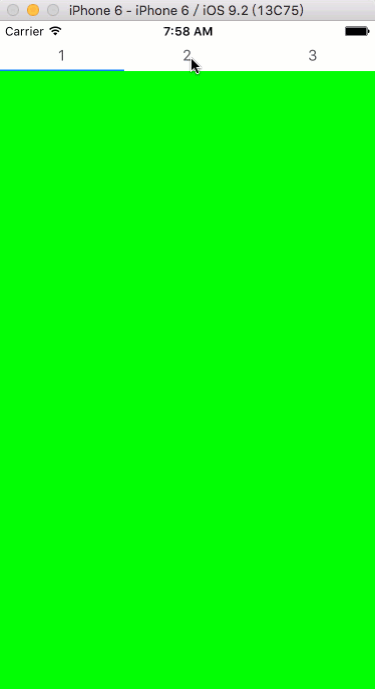

# BSSegmentPagingView

A simple paging view for iOS.



## Installation

Available in [CocoaPods](http://cocoapods.org/?q= BSSegmentPagingView)

```
pod 'BSSegmentPagingView'
```

or 

1. Copy `BSSegmentPagingView` folder to project;
2. Install `Masonry` via CocoaPods or other way.

## How To Use

### Step 1

```
#import "BSSegmentPagingView.h"
```

### Step 2

1. Create a instance of `BSSegmentPagingView`;
2. Add it to a superview;
3. Setup its data source and delegate.

### Step 3

Implement necessary methods of `BSSegmentPagingViewDelegate` and `BSSegmentPagingViewDataSource`

Example implementation:

```
#pragma - mark BSSegmentPagingViewDelegate

- (void)bsPagingView:(BSSegmentPagingView *)pagingView didScrollToPage:(NSUInteger)pageIndex {
    self.segmentControl.selectedSegmentIndex = pageIndex;
}

#pragma - mark BSSegmentPagingViewDataSource

- (NSUInteger)numberOfPageInPagingView:(BSSegmentPagingView *)pagingView {
    return 3;
}

- (UIView *)pageAtIndex:(NSUInteger)index {
    UIView *view = [[UIView alloc] init];
    
    switch (index) {
        case 0:
            view.backgroundColor = [UIColor greenColor];
            break;
        case 1:
        {
            SecondPageViewController *secondPageVC = [[SecondPageViewController alloc] init];
            [self addChildViewController:secondPageVC];
            [secondPageVC didMoveToParentViewController:self];
            
            return secondPageVC.view;
        }
            break;
        case 2:
            view.backgroundColor = [UIColor blueColor];
            break;
            
        default:
            break;
    }
    
    return view;
}
```